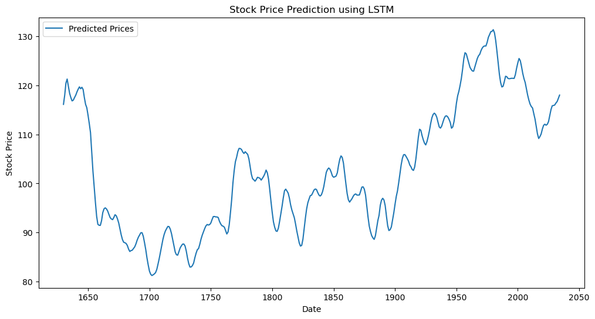

# LGMVIP-DataScience-Task-2
# Stock Market Prediction and Forecasting Using Stacked LSTM

 
This repository contains code and resources for predicting and forecasting stock market prices using Stacked LSTM.

## Table of Contents

- [Introduction](#introduction)
- [Prerequisites](#prerequisites)
- [Installation](#installation)
- [Usage](#usage)
- [Results](#results)
- [Contributing](#contributing)
- [License](#license)

## Introduction

In this project, we implement a Stock Market Prediction and Forecasting model using Stacked Long Short-Term Memory (LSTM) networks. LSTM is a type of recurrent neural network (RNN) that is well-suited for sequence prediction tasks. By training an LSTM model on historical stock price data, we aim to predict and forecast future stock prices.

## Prerequisites

Before you begin, ensure you have met the following requirements:

- Python 3.x
- Libraries: TensorFlow, Keras, pandas, numpy, matplotlib, etc.

## Installation

1. Clone this repository:
   ```bash
   git clone https://github.com/akshitaadhikari/LGMVIP-DataScience-Task-2.git
   cd LGMVIP-DataScience-Task-2
   ```

2. Install the required libraries:
   ```bash
   pip install -r requirements.txt
   ```

## Usage

1. Prepare your dataset: You need historical stock price data in a suitable format. You can use libraries like `pandas` to load and preprocess the data.

2. Train the model: Run the provided script `train_model.py` to train the Stacked LSTM model on your dataset.

3. Make predictions: Use the trained model to make predictions on unseen data using the script `predict.py`.

## Results

 <!-- Replace this with actual visualizations or results -->

## Contributing

Contributions are always welcome! If you have suggestions for improvements or new features, feel free to open issues or pull requests.

## License

This project is licensed under the [MIT License](LICENSE).
```
